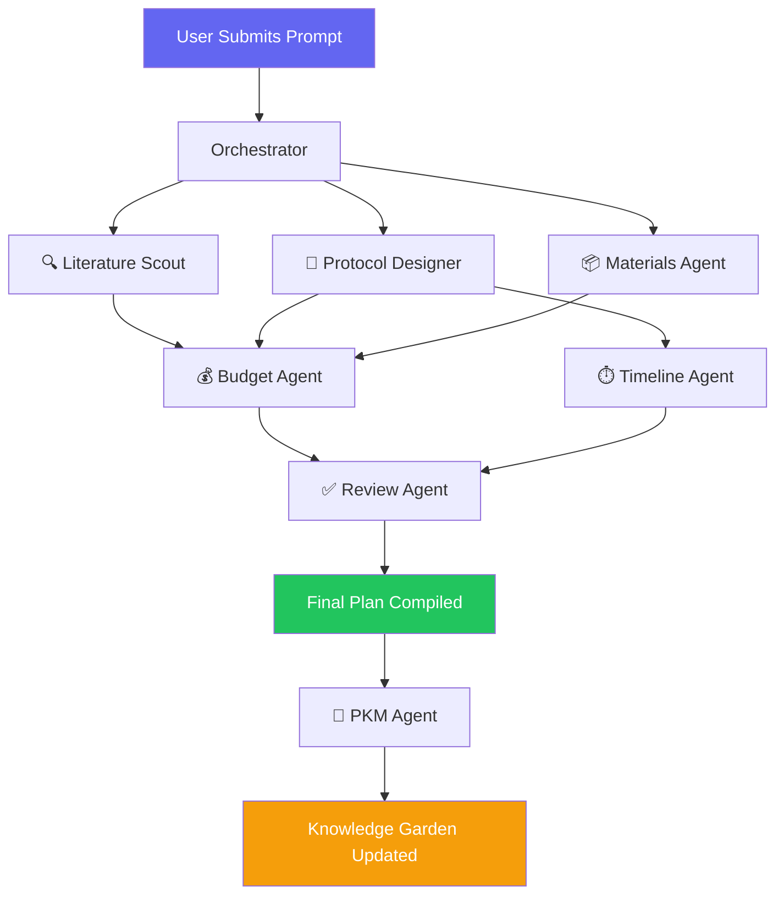

# 🧬 The AI Scientist

> **Compress weeks of experiment planning into minutes.**

**Hackathon:** Fulcrum × Hack-Nation @ World Bank Youth Summit 2026  
**Stack:** React.js + TypeScript · FastAPI · Tavily · Supabase · Vercel  

Turn a natural-language scientific hypothesis into a **complete, executable experiment plan** — protocol, materials with real catalog numbers, budget, timeline with dependencies, and validation criteria — in under 60 seconds.

---

## 📋 Table of Contents

- [Core Challenge](#-core-challenge)
- [Why Not Just Use ChatGPT?](#-why-not-just-use-chatgpt)
- [Architecture](#-architecture)
- [Multi-Agent System](#-multi-agent-system)
- [Literature QC](#-literature-qc)
- [Experiment Plan Output](#-experiment-plan-output)
- [Knowledge Garden (PKM)](#-knowledge-garden-pkm)
- [UI/UX Design](#-uiux-design)
- [Tech Stack Details](#-tech-stack-details)
- [Getting Started](#-getting-started)
- [Environment Variables](#-environment-variables)
- [Sample Inputs & Expected Outputs](#-sample-inputs--expected-outputs)
- [Deployment](#-deployment)
- [Roadmap & Priorities](#-roadmap--priorities)
- [Common Pitfalls](#-common-pitfalls)
- [License](#-license)

---

## 🎯 Core Challenge

The quality bar is simple:

> *"Would a real scientist trust this plan enough to order the materials and start running it on Monday?"*

### Three Required Stages

| Stage | Description |
|-------|-------------|
| **1. Literature QC** | Has this exact experiment been done before? Fast signal: `not found` / `similar work exists` / `exact match found` + 1–3 references |
| **2. Experiment Plan** | Protocol, materials with catalog numbers, budget, timeline with dependencies, validation approach |
| **3. Scientist Review** *(Stretch)* | Structured feedback loop where corrections become training signals for future plans |

---

## 🧠 Why Not Just Use ChatGPT?

| | ChatGPT / DeepSeek | **The AI Scientist** |
|---|---|---|
| **Output** | Text report | Executable plan with structured components |
| **Architecture** | Single monolithic response | Multi-agent with live visible specialists |
| **Memory** | No memory between sessions | Knowledge Garden PKM that learns from corrections |
| **Specificity** | Generic suggestions ("use antibodies") | Specific operational details ("Anti-CRP ab8278, Abcam, €395") |
| **Quality** | No quality control | Review agent checks internal consistency |

### Elevator Pitch

> *"ChatGPT Research writes an essay about your experiment. Our tool hands you the shopping list, the protocol, and the timeline — ready to execute. And it remembers what your lab corrected, getting better every time."*

---

## 🏗️ Architecture

```
┌──────────────────┐     SSE/WebSocket     ┌─────────────────────┐
│   Next.js 15      │ ◄──────────────────► │  FastAPI (Python)    │
│   (Vercel)        │                      │  (Railway)           │
│   + Vercel AI SDK │                      │                      │
│   + shadcn/ui     │                      │  Agent Orchestrator  │
│   + Tailwind      │                      │  + LangGraph         │
└──────────────────┘                      └─────────────────────┘
        │                                           │
        │                                           │
   Supabase Realtime                         ┌──────┴──────┐
   (Live Agent Updates)                      │             │
                                      ┌──────▼──────┐ ┌───▼────────┐
                                      │   Tavily    │ │   LLM      │
                                      │ /search     │ │ (GPT-4o /  │
                                      │ /extract    │ │  Claude)   │
                                      │ /research   │ │            │
                                      └─────────────┘ └────────────┘
```

### Data Flow

1. User submits a scientific hypothesis via the Next.js frontend
2. Request hits the FastAPI backend, which spawns agents via LangGraph
3. Agents query Tavily for literature and protocol discovery, and the LLM for reasoning
4. Live progress updates stream to the frontend via **SSE** and **Supabase Realtime**
5. Results compile into a structured JSON experiment plan
6. Knowledge nodes are extracted and stored for future reference

---

## 🤖 Multi-Agent System

### Agent Definitions

| Agent | Role | Tools / APIs | Key Output |
|-------|------|-------------|------------|
| 🔍 **Literature Scout** | Check if experiment exists, find references | Tavily `/search`, `/extract` | Novelty signal + 1–3 refs |
| 🧪 **Protocol Designer** | Generate step-by-step methodology | Tavily `/search`, `/extract` on protocols.io, Nature Protocols | Numbered protocol steps with durations |
| 📦 **Materials Agent** | Find reagents, catalog numbers, suppliers | `product_catalog.json`, Tavily `/search` for prices | Materials table with catalog numbers |
| 💰 **Budget Agent** | Calculate total costs with line items | Materials Agent output + pricing data | Budget breakdown table |
| ⏱️ **Timeline Agent** | Calculate dependencies and schedule | Protocol steps from Protocol Designer | Phased timeline with dependencies |
| ✅ **Review Agent** | Validate internal consistency | All agent outputs | Warnings, consistency checks |
| 🧠 **PKM Agent** | Extract knowledge nodes from plans | Supabase (`knowledge_nodes` table) | Auto-tagged knowledge graph entries |

### Agent Communication Flow



1. **Parallel phase:** Orchestrator spawns Literature Scout + Protocol Designer + Materials Agent simultaneously
2. **Streaming:** All agents stream status updates → Supabase Realtime → Frontend shows live progress cards
3. **Dependent phase:** Budget Agent + Timeline Agent run after initial agents finish
4. **Validation:** Review Agent validates → warnings/errors back to relevant agents for revision
5. **Compilation:** Final plan compiled → Plan JSON + Knowledge Nodes saved to Supabase
6. **Learning:** PKM Agent extracts insights → Knowledge Garden updated

### System Prompts (Key Principle)

Each agent receives a role-specific system prompt that defines:

- **Who they are** — e.g., *"You are a senior lab technician with 15 years of experience in immunoassays"*
- **Their specific task** — e.g., *"Generate a step-by-step protocol for the given experiment..."*
- **Required output format** — strict JSON schema
- **Data sources they can access** — Tavily, product catalog
- **Quality constraints** — e.g., *"Every reagent must have a catalog number or supplier reference"*

---

## 📚 Literature QC

### Flow

1. **Query Construction** — Extract key concepts from user prompt → build search query
2. **Tavily `/search`** — `search_depth: "advanced"`, `include_domains`: PubMed, arXiv, Semantic Scholar, protocols.io
3. **Result Classification:**
   - `exact_match` — Protocol steps match >90%, same reagents, same expected outcomes
   - `similar_work_exists` — Same domain, similar methodology, different specific target
   - `not_found` — No close matches in literature
4. **Reference Extraction** — Tavily `/extract` on top 3 results → titles, authors, DOI, key findings

### Example Output

```json
{
  "novelty_signal": "similar_work_exists",
  "references": [
    {
      "title": "Paper-based electrochemical biosensor for CRP detection in whole blood",
      "authors": "Zhang et al.",
      "year": 2024,
      "journal": "Biosensors and Bioelectronics",
      "doi": "10.1016/j.bios.2024.xxxxx",
      "similarity": "similar_methodology",
      "key_difference": "Used serum samples, not whole blood; detection limit 1.0 mg/L vs requested 0.5 mg/L"
    }
  ],
  "summary": "Found 2 papers with similar electrochemical CRP detection approaches, but none achieving the requested sensitivity in untreated whole blood."
}
```

---

## 🧪 Experiment Plan Output

### Complete JSON Structure

```json
{
  "plan_id": "uuid",
  "title": "Automated from hypothesis",
  "hypothesis": "Original user input (restated formally)",
  "literature_qc": { "..." },
  "protocol": {
    "steps": [
      {
        "step_number": 1,
        "action": "Functionalize paper substrate with anti-CRP antibodies",
        "duration": "2 hours",
        "details": "Soak Whatman #1 paper in 1 mg/mL anti-CRP (ab8278) in carbonate buffer pH 9.6 for 2h at RT",
        "notes": "Include negative control: paper incubated with BSA only",
        "source": "Adapted from: Zhang et al. 2024, protocols.io/protocols/xyz"
      }
    ],
    "total_duration": "8 hours (across 2 days)",
    "controls": ["BSA-coated negative control", "Commercial ELISA positive control"]
  },
  "materials": [
    {
      "item": "Anti-CRP monoclonal antibody (clone CRP-8)",
      "catalog_number": "ab8278",
      "supplier": "Abcam",
      "quantity": "100 µg",
      "unit_price": 395.00,
      "currency": "EUR",
      "total_price": 395.00,
      "storage": "-20°C"
    }
  ],
  "budget": {
    "total": 1847.50,
    "currency": "EUR",
    "breakdown": {
      "reagents": 1250.00,
      "consumables": 345.50,
      "equipment_usage": 252.00
    },
    "notes": "Prices as of April 2026, excluding VAT and shipping"
  },
  "timeline": {
    "phases": [
      {
        "phase": "Preparation",
        "duration": "2 days",
        "tasks": ["Order materials", "Prepare buffers", "Coat paper substrates"],
        "dependencies": [],
        "start_day": 1
      },
      {
        "phase": "Assay Development",
        "duration": "3 days",
        "tasks": ["Optimize antibody concentration", "Calibrate electrochemical reader", "Run pilot tests"],
        "dependencies": ["Preparation"],
        "start_day": 3
      },
      {
        "phase": "Validation",
        "duration": "2 days",
        "tasks": ["Test with spiked samples", "Compare with ELISA", "Statistical analysis"],
        "dependencies": ["Assay Development"],
        "start_day": 6
      }
    ],
    "total_duration": "7 working days"
  },
  "validation": {
    "success_criteria": [
      "Detection limit ≤ 0.5 mg/L CRP in whole blood",
      "Assay time ≤ 10 minutes from sample application",
      "R² ≥ 0.95 vs commercial ELISA",
      "CV < 15% for intra-assay replicates"
    ],
    "controls": [
      "Negative: PBS only",
      "Positive: 10 mg/L CRP standard",
      "Matrix: Whole blood from 3 donors, spiked at 0.1, 0.5, 1.0, 5.0 mg/L"
    ],
    "statistical_plan": "n=3 technical replicates × 3 biological replicates; ANOVA with post-hoc Tukey"
  },
  "generated_at": "ISO timestamp",
  "knowledge_nodes_extracted": ["uuid1", "uuid2"]
}
```

---

## 🧠 Knowledge Garden (PKM)

> The "learning system" differentiator. Every correction a scientist makes becomes a knowledge node that improves future plans automatically.

### Supabase Schema

```sql
-- Runs table for orchestrator lifecycle
CREATE TABLE experiment_runs (
  run_id TEXT PRIMARY KEY,
  hypothesis TEXT NOT NULL,
  experiment_type TEXT,
  status TEXT NOT NULL,                 -- pending/running/completed/failed
  plan_id UUID,
  error_message TEXT,
  created_at TIMESTAMPTZ DEFAULT NOW(),
  updated_at TIMESTAMPTZ DEFAULT NOW()
);

-- Append-only agent event stream (Realtime primary source for UI)
CREATE TABLE agent_events (
  event_id UUID PRIMARY KEY DEFAULT gen_random_uuid(),
  run_id TEXT NOT NULL REFERENCES experiment_runs(run_id) ON DELETE CASCADE,
  sequence BIGINT NOT NULL,
  agent_id UUID REFERENCES agents(id) ON DELETE SET NULL,
  agent TEXT NOT NULL,
  phase TEXT NOT NULL,                  -- starting/progress/complete/error
  status TEXT NOT NULL,                 -- started/completed/failed
  message TEXT,
  payload JSONB DEFAULT '{}'::jsonb,
  from_agent TEXT,
  to_agent TEXT,
  timestamp TIMESTAMPTZ DEFAULT NOW()
);

CREATE INDEX idx_agent_events_run_seq ON agent_events(run_id, sequence);
CREATE INDEX idx_agent_events_created ON agent_events(timestamp);

-- Dynamic agent registry (selected per run by Planner)
CREATE TABLE agents (
  id UUID PRIMARY KEY DEFAULT gen_random_uuid(),
  key TEXT UNIQUE NOT NULL,                -- stable machine key, e.g. 'literature_scout'
  name TEXT NOT NULL,                      -- display name
  role TEXT NOT NULL,                      -- concise responsibility
  personality TEXT,
  capabilities TEXT[] DEFAULT '{}',        -- capability tags used by planner
  prompt_template TEXT NOT NULL,
  is_active BOOLEAN DEFAULT TRUE,
  metadata JSONB DEFAULT '{}'::jsonb,
  created_at TIMESTAMPTZ DEFAULT NOW(),
  updated_at TIMESTAMPTZ DEFAULT NOW()
);

-- Run-scoped lifecycle for each selected agent
CREATE TABLE run_agents (
  id UUID PRIMARY KEY DEFAULT gen_random_uuid(),
  run_id TEXT NOT NULL REFERENCES experiment_runs(run_id) ON DELETE CASCADE,
  agent_id UUID NOT NULL REFERENCES agents(id) ON DELETE RESTRICT,
  status TEXT NOT NULL,                    -- pending/ready/running/completed/failed/skipped
  progress_pct INT DEFAULT 0,
  started_at TIMESTAMPTZ,
  completed_at TIMESTAMPTZ,
  error_message TEXT,
  metadata JSONB DEFAULT '{}'::jsonb,
  created_at TIMESTAMPTZ DEFAULT NOW(),
  updated_at TIMESTAMPTZ DEFAULT NOW(),
  UNIQUE (run_id, agent_id)
);

CREATE INDEX idx_run_agents_run_status ON run_agents(run_id, status);

-- Structured inter-agent communication stream
CREATE TABLE agent_messages (
  id UUID PRIMARY KEY DEFAULT gen_random_uuid(),
  run_id TEXT NOT NULL REFERENCES experiment_runs(run_id) ON DELETE CASCADE,
  sequence BIGINT NOT NULL,
  message_type TEXT NOT NULL,              -- request/response/handoff/broadcast/system
  from_agent_id UUID REFERENCES agents(id) ON DELETE SET NULL,
  to_agent_id UUID REFERENCES agents(id) ON DELETE SET NULL,
  from_agent TEXT,
  to_agent TEXT,
  subject TEXT,
  message TEXT,
  payload JSONB DEFAULT '{}'::jsonb,
  created_at TIMESTAMPTZ DEFAULT NOW(),
  UNIQUE (run_id, sequence)
);

CREATE INDEX idx_agent_messages_run_created_at ON agent_messages(run_id, created_at);

-- Enable Realtime on agent_events + run_agents + agent_messages

-- Knowledge Nodes (the "notes")
CREATE TABLE knowledge_nodes (
  id UUID PRIMARY KEY DEFAULT gen_random_uuid(),
  title TEXT NOT NULL,
  content TEXT,
  node_type TEXT NOT NULL,              -- 'experiment', 'protocol', 'reagent', 'correction', 'insight'
  experiment_type TEXT,                  -- e.g. 'elisa_biosensor', 'cell_freezing'
  parent_ids UUID[] DEFAULT '{}',
  metadata JSONB,
  embedding VECTOR(1536),               -- For semantic search (OpenAI embeddings)
  times_applied INTEGER DEFAULT 1,
  confidence_score FLOAT DEFAULT 0.5,   -- 0.5 = unverified, 1.0 = confirmed by multiple reviews
  created_at TIMESTAMPTZ DEFAULT NOW(),
  updated_at TIMESTAMPTZ DEFAULT NOW(),
  created_by TEXT DEFAULT 'ai-agent',
  tags TEXT[] DEFAULT '{}'
);

-- Connections between nodes (for graph visualization)
CREATE TABLE knowledge_edges (
  id UUID PRIMARY KEY DEFAULT gen_random_uuid(),
  source_id UUID REFERENCES knowledge_nodes(id) ON DELETE CASCADE,
  target_id UUID REFERENCES knowledge_nodes(id) ON DELETE CASCADE,
  relationship_type TEXT,               -- 'improves', 'depends_on', 'similar_to', 'corrects', 'uses'
  weight FLOAT DEFAULT 1.0,
  metadata JSONB,
  created_at TIMESTAMPTZ DEFAULT NOW()
);

-- Indexes
CREATE INDEX idx_knowledge_tags ON knowledge_nodes USING GIN(tags);
CREATE INDEX idx_knowledge_type ON knowledge_nodes(node_type);
CREATE INDEX idx_knowledge_experiment ON knowledge_nodes(experiment_type);
```

### Auto-Extraction After Plan Generation

The PKM Agent automatically creates knowledge nodes:

1. **Experiment Node** — The full plan as a knowledge artifact
2. **Protocol Step Nodes** — Each major step becomes a reusable protocol component
3. **Reagent Nodes** — Each reagent with catalog info becomes a reference node
4. **Correction Nodes** — When a scientist reviews and corrects, a correction node is created and linked

### Feedback Loop

```python
# When a scientist corrects something:
correction = {
    "experiment_type": "elisa_biosensor",
    "field_path": "protocol.steps[2].duration",
    "old_value": "30 minutes",
    "new_value": "60 minutes",
    "reason": "Better signal-to-noise ratio at 60 min for whole blood samples"
}

# Save as knowledge node
node = {
    "title": f"💡 Correction: {correction['experiment_type']} - Incubation Time",
    "node_type": "correction",
    "experiment_type": correction["experiment_type"],
    "content": f"Changed from {correction['old_value']} → {correction['new_value']}. Reason: {correction['reason']}",
    "metadata": correction,
    "tags": ["correction", correction["experiment_type"], "incubation"]
}

# On next similar experiment:
# Query: SELECT * FROM knowledge_nodes
#   WHERE experiment_type = 'elisa_biosensor' AND node_type = 'correction'
# Result: Inject corrections as few-shot examples into agent prompt
```

### Knowledge Garden UI

- **Tab:** 🧠 Knowledge Garden (third main tab)
- **Visualization:** `react-force-graph-2d` showing nodes and edges
- **Color Coding:**
  - 🧪 Blue — Experiment nodes
  - 💡 Gold — Correction nodes
  - 🧬 Green — Reagent nodes
  - 📋 Purple — Protocol step nodes
- **Size:** Node size proportional to `times_applied` (frequently used = larger)
- **Interaction:** Click to open detail panel, double-click to edit

---

## 🎨 UI/UX Design

### Layout

```
┌─────────────────────────────────────────────────────────────┐
│  🤖 The AI Scientist                          [Settings] [⚡] │
├─────────────────────────────────────────────────────────────┤
│                                                             │
│  ┌───────────────────────────────────────────────────────┐  │
│  │  Scientific Question Input                             │  │
│  │  ┌─────────────────────────────────────────────────┐  │  │
│  │  │ Type a hypothesis...                             │  │  │
│  │  └─────────────────────────────────────────────────┘  │  │
│  │  [✨ Generate Plan]  [📎 Attach Context]              │  │
│  └───────────────────────────────────────────────────────┘  │
│                                                             │
│  ┌─ Live Agent Progress ────────────────────────────────┐  │
│  │  🔍 Literature   🧪 Protocol   📦 Materials   💰 Budget  │
│  │  [████████░░] 80% [██████░░░░] 60% [███░░░░░░░] 30%     │
│  └───────────────────────────────────────────────────────┘  │
│                                                             │
│  ┌─ Results Tabs ───────────────────────────────────────┐  │
│  │ [📋 Protocol] [🧴 Materials] [💰 Budget] [📅 Timeline]   │
│  │ [✅ Validation] [📚 Literature] [🧠 Knowledge Garden]     │
│  ├─────────────────────────────────────────────────────┤  │
│  │  (Active tab content renders here)                  │  │
│  └─────────────────────────────────────────────────────┘  │
└─────────────────────────────────────────────────────────────┘
```

### Key UI Features

| Feature | Description |
|---------|-------------|
| **Live Agent Cards** | Each agent gets a card with progress bar, current status text, and animated icon |
| **Tab Navigation** | Clean shadcn/ui tabs for each plan component |
| **Budget Summary** | Pie chart (Recharts) + sortable table |
| **Timeline View** | Horizontal bar showing phases with dependency arrows |
| **Material Table** | Searchable, filterable table with catalog numbers as clickable links |
| **Review Mode** | Toggle that enables editing of plan fields with reason input for corrections |
| **Dark Mode** | Default on — essential for lab use, Tailwind dark mode with `class` strategy |

---

## ⚙️ Tech Stack Details

### Frontend

| Technology | Purpose |
|-----------|---------|
| **Next.js 15** | React framework with App Router |
| **Vercel AI SDK** | Streaming chat/completion primitives |
| **shadcn/ui** | Accessible, composable UI components |
| **Tailwind CSS** | Utility-first styling, dark mode |
| **Recharts** | Budget pie charts, bar graphs |
| **react-force-graph-2d** | Knowledge Garden graph visualization |

### Backend

| Technology | Purpose |
|-----------|---------|
| **FastAPI** | Async Python web framework |
| **LangGraph** | Agent orchestration and state management |
| **Tavily API** | Web search (`/search`), content extraction (`/extract`), deep research (`/research`) |
| **OpenAI / Anthropic SDK** | LLM inference (GPT-4o or Claude, configurable) |

### Database & Infrastructure

| Technology | Purpose |
|-----------|---------|
| **Supabase** | PostgreSQL database, Realtime subscriptions, pgvector for embeddings |
| **Vercel** | Frontend hosting, edge functions, analytics |
| **Railway** | Backend hosting for FastAPI |

### Streaming Architecture

SSE (Server-Sent Events) for real-time agent updates:

```python
# FastAPI backend
@app.post("/generate-plan")
async def generate_plan(prompt: str):
    async def event_generator():
        yield f"data: {json.dumps({'phase': 'starting', 'agents': ['literature', 'protocol', 'materials']})}\n\n"

        lit_result = await literature_scout.search(prompt)
        yield f"data: {json.dumps({'phase': 'progress', 'agent': 'literature', 'result': lit_result})}\n\n"

        protocol_task = asyncio.create_task(protocol_designer.design(prompt))
        materials_task = asyncio.create_task(materials_agent.search(prompt))

        for task in asyncio.as_completed([protocol_task, materials_task]):
            result = await task
            yield f"data: {json.dumps({'phase': 'progress', 'agent': result.agent_name, 'data': result})}\n\n"

        plan = compile_plan(lit_result, protocol_task.result(), materials_task.result())
        yield f"data: {json.dumps({'phase': 'complete', 'plan': plan})}\n\n"

    return StreamingResponse(event_generator(), media_type="text/event-stream")
```

### Frontend Streaming (Vercel AI SDK)

```typescript
import { useChat } from '@ai-sdk/react';

export function PlanGenerator() {
  const { messages, sendMessage, isLoading } = useChat({
    api: '/api/generate-plan',
    onFinish: (message) => {
      setPlan(JSON.parse(message.content));
    }
  });

  return (
    <div>
      <button onClick={() => sendMessage({ content: prompt })} disabled={isLoading}>
        {isLoading ? 'Generating...' : 'Generate Plan'}
      </button>
      <AgentProgressCards messages={messages} />
    </div>
  );
}
```

### Supabase Realtime

```typescript
// Subscribe to agent progress channel
const channel = supabase.channel('agent-progress')
  .on('broadcast', { event: 'agent-update' }, (payload) => {
    updateAgentStatus(payload.agent, payload.status);
  })
  .subscribe();
```

---

## 🚀 Getting Started

### Prerequisites

- **Node.js** ≥ 18
- **Python** ≥ 3.11
- **pnpm** (or npm/yarn)
- API keys: Supabase, Tavily, OpenAI or Anthropic

### Installation

```bash
# Clone the repo
git clone https://github.com/<org>/hacknation-AI-Scientist.git
cd hacknation-AI-Scientist

# Frontend
cd frontend
pnpm install
cp .env.example .env.local   # fill in your keys
pnpm dev

# Backend (in a separate terminal)
cd backend
python -m venv venv
source venv/bin/activate
pip install -r requirements.txt
cp .env.example .env          # fill in your keys
uvicorn app.main:app --reload --port 8000
```

---

## ✅ Phase-5 Validation (Dynamic Orchestration)

Ein ausführbarer Smoke-/Integration-Check ist unter `backend/validate_dynamic_orchestration.py` verfügbar.

Er prüft automatisiert:

- parallele Runs (standardmäßig 3)
- Konsistenz von `GET /runs/{run_id}/graph`
- Persistenz von `events` und `messages`
- Reconnect-Idempotenz (keine doppelten Sequenzen, monotone Reihenfolge)
- mindestens 2 Handoffs pro Run
- Tool-Capability-Gating anhand `allowed_tools`

Beispiel:

```bash
python backend/validate_dynamic_orchestration.py --base-url http://localhost:8000 --runs 3
```

Rückgabecode:

- `0` = alle Checks erfolgreich
- `1` = mindestens ein Check fehlgeschlagen

---

## 🔑 Environment Variables

```env
# Supabase
SUPABASE_URL=https://[project].supabase.co
SUPABASE_ANON_KEY=eyJ...
SUPABASE_SERVICE_KEY=eyJ...

# Tavily
TAVILY_API_KEY=tvly-...

# LLM (pick one or both)
OPENAI_API_KEY=sk-...
ANTHROPIC_API_KEY=sk-ant-...

# App
ALLOWED_ORIGINS=https://[project].vercel.app
MAX_PLAN_SIZE_MB=5
STREAMING_TIMEOUT_SECONDS=120
```

---

## 📊 Sample Inputs & Expected Outputs

### Input 1: Diagnostics

> *"A paper-based electrochemical biosensor functionalized with anti-CRP antibodies will detect C-reactive protein in whole blood at concentrations below 0.5 mg/L within 10 minutes, matching laboratory ELISA sensitivity without requiring sample preprocessing."*

**Expected:** Literature QC finds Zhang et al. 2024 (similar, but serum not whole blood). Plan includes Whatman #1 paper, anti-CRP ab8278, screen-printed electrodes, chronoamperometry at +0.2V vs Ag/AgCl. Budget: ~€1,800. Timeline: 7 working days.

### Input 2: Gut Health

> *"Supplementing C57BL/6 mice with Lactobacillus rhamnosus GG for 4 weeks will reduce intestinal permeability by at least 30% compared to controls, measured by FITC-dextran assay, due to upregulation of tight junction proteins claudin-1 and occludin."*

**Expected:** Literature QC finds similar LGG studies. Plan includes animal model design, LGG administration (10⁹ CFU/day), FITC-dextran assay protocol, Western Blot for claudin-1/occludin. Budget: ~€3,500 (including mouse costs). Timeline: 8 weeks.

### Input 3: Cell Biology

> *"Replacing sucrose with trehalose as a cryoprotectant in the freezing medium will increase post-thaw viability of HeLa cells by at least 15 percentage points compared to the standard DMSO protocol, due to trehalose's superior membrane stabilization at low temperatures."*

**Expected:** Literature QC finds trehalose cryopreservation papers. Plan includes HeLa cell culture, freezing media with 0.2M trehalose + 10% DMSO vs standard 10% DMSO, controlled-rate freezing, trypan blue viability. Budget: ~€950. Timeline: 2 weeks.

---

## 🌐 Deployment

| Component | Platform | Configuration |
|-----------|----------|--------------|
| **Frontend** | Vercel | Next.js with `output: 'standalone'`, env vars for API URLs |
| **Backend** | Railway | Python 3.11, FastAPI with uvicorn, 512 MB RAM minimum |
| **Database** | Supabase | Free tier (500 MB DB, 5 GB bandwidth), enable pgvector extension |
| **Monitoring** | Vercel Analytics | Basic + custom events for plan generation tracking |

---

## 🗺️ Roadmap & Priorities

### P0 — Must Have (Hackathon MVP)

- [x] Project planning & architecture design
- [ ] Working prompt → plan pipeline with SSE streaming
- [ ] Literature QC with Tavily (novelty signal + refs)
- [ ] Tabs: Protocol, Materials (with catalog numbers), Budget, Timeline
- [ ] Live agent progress cards (3–4 agents visible)

### P1 — Should Have

- [ ] Scientist feedback/correction UI
- [ ] Knowledge nodes from corrections (Supabase)
- [ ] Knowledge graph visualization (react-force-graph)
- [ ] Corrections injected as few-shot examples into future prompts

### P2 — Nice to Have

- [ ] Validation tab with Review Agent
- [ ] PDF export of experiment plans
- [ ] Dark mode toggle
- [ ] Product catalog search integration

---

## ⚠️ Common Pitfalls

| Problem | Solution |
|---------|----------|
| Agents too slow | 30 s timeout per agent, show partial results |
| Hallucinated catalog numbers | Cross-reference `product_catalog.json`, flag unverified items |
| Oversized plans | Max 15 protocol steps, 25 materials |
| SSE connection drops | Reconnection logic + "Reconnecting..." toast |
| Knowledge graph clutter | Max 50 visible nodes, filter by experiment type |

---

## 📄 License

MIT — see [LICENSE](LICENSE) for details.

---

<p align="center">
  Built with ❤️ at <strong>Fulcrum × Hack-Nation @ World Bank Youth Summit 2026</strong>
</p>