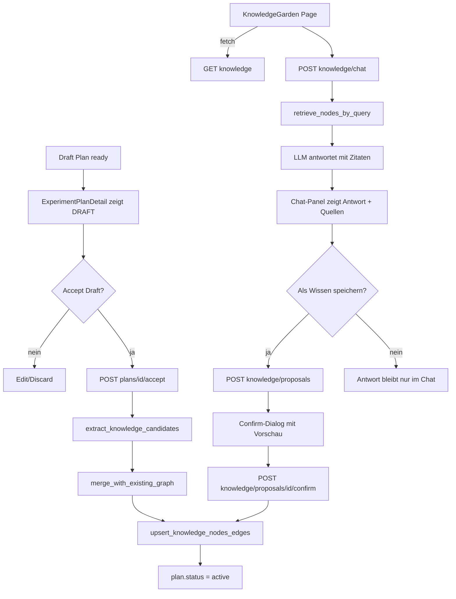

# Plan: Draft → Knowledge Graph → Graph-Chat

## 0. Ist-Analyse (kurz, weil entscheidend)

| Bereich | Status heute | Ziel |
|---|---|---|
| `knowledge_nodes`/`knowledge_edges` Tabellen | **fehlen in DB**, nur `_knowledge_nodes` Dict im `SupabaseRepository` | echte Tabellen mit `status`, `source_type`, `source_ref`, `confidence` |
| Auto-Insert nach Plan-Bau | `orchestrator.py:438-441` schreibt sofort 1 Experiment-Knoten | nur **Kandidaten** sammeln, kein Auto-Insert |
| Accept-Draft UI | nicht vorhanden, `ExperimentPlanDetail.tsx` hat nur "EXPORT PDF" | Header-Action „Accept Draft" mit Confirm-Dialog |
| `build_knowledge_nodes()` in `agents.py:1852` | existiert, wird **nicht** aufgerufen | als Basis für Candidate-Extraction wiederverwenden |
| Chat-Endpoint | fehlt | `POST /knowledge/chat` mit Retrieval + Zitaten |
| Save-from-Chat | fehlt | Proposal → Confirm → Upsert |

## 1. Datenmodell

Neue Migration `backend/supabase/migrations/20260427_knowledge_graph.sql`:

```sql
create table if not exists public.knowledge_nodes (
  id text primary key,
  title text not null,
  node_type text not null check (node_type in ('experiment','correction','reagent','claim','entity','chat_insight')),
  experiment_type text,
  content text,
  metadata jsonb not null default '{}'::jsonb,
  tags text[] not null default '{}',

  status text not null default 'pending'
    check (status in ('pending','active','archived')),
  source_type text not null default 'plan_draft'
    check (source_type in ('plan_draft','user_correction','chat_insight','literature','manual')),
  source_ref text,
  confidence numeric(4,3) not null default 0.7 check (confidence between 0 and 1),

  created_by text,
  created_at timestamptz not null default timezone('utc', now()),
  updated_at timestamptz not null default timezone('utc', now())
);

create index if not exists idx_knowledge_nodes_status on public.knowledge_nodes(status);
create index if not exists idx_knowledge_nodes_source on public.knowledge_nodes(source_type, source_ref);
create index if not exists idx_knowledge_nodes_tags_gin on public.knowledge_nodes using gin(tags);
create index if not exists idx_knowledge_nodes_title_trgm on public.knowledge_nodes using gin (title gin_trgm_ops);

create table if not exists public.knowledge_edges (
  id uuid primary key default gen_random_uuid(),
  source_id text not null references public.knowledge_nodes(id) on delete cascade,
  target_id text not null references public.knowledge_nodes(id) on delete cascade,
  relationship_type text not null,
  weight numeric(4,3) not null default 1.0,
  source_type text not null default 'plan_draft',
  source_ref text,
  metadata jsonb not null default '{}'::jsonb,
  created_at timestamptz not null default timezone('utc', now()),
  unique (source_id, target_id, relationship_type)
);

create table if not exists public.knowledge_proposals (
  id uuid primary key default gen_random_uuid(),
  kind text not null check (kind in ('plan_draft','chat_insight')),
  source_ref text,
  payload jsonb not null,
  status text not null default 'pending'
    check (status in ('pending','confirmed','rejected')),
  created_by text,
  created_at timestamptz not null default timezone('utc', now()),
  decided_at timestamptz
);

create extension if not exists pg_trgm;
create extension if not exists vector;

alter table public.knowledge_nodes
  add column if not exists embedding vector(1536);

create index if not exists idx_knowledge_nodes_embedding_hnsw
  on public.knowledge_nodes using hnsw (embedding vector_cosine_ops)
  with (m = 16, ef_construction = 64);
```

Embeddings werden mit OpenAI `text-embedding-3-small` (1536 dim) generiert, sowohl beim Accept-Ingest als auch beim Chat-Retrieval.

## 2. Architektur-Schema



## 3. Backend-Plan

### 3.1 Schemas (`backend/app/schemas/plan.py`)

Neue Pydantic-Modelle:

- `KnowledgeNode` (id, title, node_type, status, source_type, source_ref, confidence, tags, metadata, content)
- `KnowledgeEdge` (source_id, target_id, relationship_type, weight, source_type, source_ref)
- `KnowledgeCandidates` (`nodes: list[KnowledgeNode]`, `edges: list[KnowledgeEdge]`)
- `AcceptDraftResponse` (`plan_id`, `inserted_nodes: int`, `merged_nodes: int`, `inserted_edges: int`)
- `KnowledgeChatRequest` (`query: str`, `top_k: int = 8`, `experiment_type: str | None`)
- `KnowledgeChatCitation` (`node_id`, `title`, `node_type`, `score`)
- `KnowledgeChatResponse` (`answer: str`, `citations: list[KnowledgeChatCitation]`, `proposed_save: KnowledgeNode | None`)
- `KnowledgeProposal` (`id`, `kind`, `payload: KnowledgeCandidates`, `source_ref`, `status`)

### 3.2 Services

`backend/app/services/pkm.py` (neu) bündelt:

```python
def extract_knowledge_candidates(plan: ExperimentPlan) -> KnowledgeCandidates: ...
async def merge_with_existing_graph(repo, candidates) -> tuple[upsert_nodes, upsert_edges, merge_log]: ...
async def retrieve_nodes(repo, query, *, top_k=8, experiment_type=None) -> list[KnowledgeNode]: ...
async def create_chat_insight_proposal(repo, query, answer, citations) -> KnowledgeProposal: ...
```

- `extract_knowledge_candidates` baut auf `agents.build_knowledge_nodes()` auf, ergänzt:
  - Protocol-Steps → `claim`-Knoten („Step X benutzt Y bei Z°C") nur wenn nicht trivial.
  - Literature References → `literature`-Knoten + Edge `references`.
  - Reagents bleiben wie heute, mit Edge `uses`.
  - Alle Knoten initial `status='pending'`, `source_type='plan_draft'`, `source_ref=plan_id`.
- `merge_with_existing_graph` Dedupe-Kaskade:
  1. exakte Title+Type-Übereinstimmung → mergen (`times_applied += 1`, höhere Confidence).
  2. Embedding-Cosine > 0.85 **und** Type-Match → mergen.
  3. trigram-Similarity > 0.6 als Fallback wenn Embedding fehlt.
  4. sonst neuer Knoten.
- `retrieve_nodes` macht hybrid: Embedding-ANN (`<=>` mit hnsw) + Tag-Boost + optionales `experiment_type` Filter.

### 3.3 Repository (`backend/app/services/integrations.py`)

Erweitern:

- `upsert_knowledge_nodes` und `add_knowledge_edges` schreiben **wirklich** in Supabase (heute nur Memory).
- Neu: `list_knowledge_nodes(status='active')`, `find_similar_nodes(title, type, threshold)`, `create_knowledge_proposal(payload)`, `update_knowledge_proposal_status(id, status)`, `get_knowledge_proposal(id)`.

### 3.4 Endpoints (`backend/app/main.py`)

Neu:

| Methode | Pfad | Zweck |
|---|---|---|
| POST | `/plans/{plan_id}/accept` | Kandidaten extrahieren, dedupen, **upserten** als `active` |
| GET | `/knowledge/nodes` | aktive Knoten + Edges, optional `?status=` Filter |
| POST | `/knowledge/chat` | Graph-RAG Antwort + Citations |
| POST | `/knowledge/proposals` | Vorschau für „Save from Chat" erzeugen |
| POST | `/knowledge/proposals/{id}/confirm` | Vorschlag als `active` upserten |
| POST | `/knowledge/proposals/{id}/reject` | Vorschlag verwerfen |

### 3.5 Orchestrator-Anpassung (`backend/app/services/orchestrator.py`)

- Zeilen 428-441 (Auto-Insert nach Plan-Bau) **entfernen** und ersetzen durch:
  - `plan.metadata["candidate_summary"] = candidate_counts(...)`,
  - `await repo.save_plan(plan...)` ohne Knoten-Insert.
- Plan bleibt damit `draft` bis Accept.

## 4. Frontend-Plan

### 4.1 API-Client (`frontend/src/lib/api.ts`)

Neue Funktionen:

```ts
export async function acceptDraft(planId: string): Promise<AcceptDraftResponse>
export async function fetchKnowledgeGraph(filter?: { status?: 'active' | 'pending' }): Promise<KnowledgeResponse>
export async function askKnowledgeChat(req: KnowledgeChatRequest): Promise<KnowledgeChatResponse>
export async function proposeKnowledgeSave(payload: KnowledgeCandidates): Promise<KnowledgeProposal>
export async function confirmKnowledgeProposal(id: string): Promise<{ status: 'confirmed' }>
```

### 4.2 ExperimentPlanDetail (`frontend/src/pages/ExperimentPlanDetail/ExperimentPlanDetail.tsx`)

- Neuer Header-Button **„Accept Draft"** neben „EXPORT PDF":
  - Loading-State während Ingestion.
  - Toast/Banner mit Dedupe-Resultat (`X new, Y merged`).
  - Badge wechselt von `DRAFT` → `ACTIVE`.
- Sidebar-Insight-Box zeigt nach Accept einen Link „View in Knowledge Garden".

### 4.3 KnowledgeGarden (`frontend/src/pages/KnowledgeGarden/KnowledgeGarden.tsx`)

- Layout-Restrukturierung: Grid wird `1fr 380px 360px` (Canvas | Detail | **Chat**).
- Chat-Panel (`kg__chat`):
  - Liste der Messages, Input-Feld, Senden via Enter.
  - Antwortbubble zeigt Quellen-Chips (Knoten-IDs); Klick fokussiert Knoten im Canvas.
  - Footer-Action **„Save to Graph"** öffnet Confirm-Dialog mit Vorschau (Node + Edges).
- Filter-Chip: `All / Pending / Active` zur Statusfilterung.

### 4.4 Types (`frontend/src/types/plan.ts`)

Neue Interfaces analog zu Backend-Schemas (`KnowledgeNode`, `KnowledgeChatResponse`, `KnowledgeChatCitation`, `KnowledgeProposal`).

## 5. Qualität & Sicherheit

- **Kein automatischer Insert** mehr außerhalb Accept/Confirm-Pfaden.
- **Audit-Trail** auf jedem Knoten (`created_by`, `source_type`, `source_ref`).
- **Dedupe-Schwelle** trigram > 0.6 in Iteration 1; in Iteration 3 zusätzlich Embedding-Cosine > 0.85.
- **Citation-Pflicht**: Chat-Endpoint verweigert Antwort, wenn `top_k`-Retrieval leer ist (zeigt stattdessen „Nicht genug Kontext").
- **Rate-Limit** für Chat: 30 Anfragen pro Minute pro Run.
- **RLS dev-first**: Read für `anon`/`authenticated`, Write nur via Service-Key.

## 6. Iterationen

### Iteration 1 — Accept-Draft → Graph (heute)
- Migration `knowledge_graph.sql` einspielen.
- `pkm.py` mit Candidate-Extraction + trigram-Dedupe.
- `POST /plans/{id}/accept`.
- `Accept Draft`-Button im Frontend.
- `KnowledgeGarden` zeigt jetzt echte (statt Memory-) Daten.

### Iteration 2 — Graph-Chat mit Zitaten
- `POST /knowledge/chat` mit Tag/Title-Retrieval (kein Embedding nötig).
- Chat-Panel im KnowledgeGarden inkl. Citation-Chips.
- Retrieval-Empty-Guard.

### Iteration 3 — Save-Proposals + Confidence
- `POST /knowledge/proposals` + Confirm/Reject.
- Confirm-Dialog mit Node/Edge-Vorschau.
- Confidence-Berechnung aus Retrieval-Score und User-Feedback (höher bei wiederholter Bestätigung).
- Re-Rank-Schritt: Top-k Embedding-ANN → Re-rank nach Tag-Overlap und `experiment_type`.

## 7. Erfolgskriterien

- ≥ 80 % der akzeptierten Drafts erzeugen mind. 3 neue Knoten.
- Chat-Antworten zeigen ≥ 1 Citation in 95 % der Fälle.
- Duplikat-Rate (gleiche `title+type` doppelt aktiv) < 5 %.
- ≥ 50 % der gespeicherten Chat-Insights tauchen in einem späteren Run als Retrieval-Treffer wieder auf.

## 8. Metriken, Guards & Rollout

### 8.1 Dedupe-Metriken (live aus Supabase)

| Metrik | Quelle | Ziel |
|---|---|---|
| `merge_rate` | `inserted_nodes / (inserted_nodes + merged_nodes)` aus `AcceptDraftResponse` | 30–60 % nach 20+ Drafts |
| `duplicate_active_rate` | Postgres Query: `count(*)` mit gleicher `(lower(title), node_type)` und `status='active'` | < 5 % |
| `embedding_match_rate` | Anteil Merges via Embedding-Cosine ≥ 0.85 (geloggt in `metadata.merge_reason`) | > 60 % der Merges |
| `trigram_fallback_rate` | Anteil Merges via Trigram ohne Embedding-Treffer | < 30 % |

Logging: Jeder Merge-Pfad schreibt `metadata.merge_reason ∈ {exact_title, embedding, trigram, none}` plus `metadata.merge_score` für Audit.

### 8.2 Audit & Sicherheit

- **Audit-Felder pflichtig**: `created_by`, `source_type`, `source_ref`, `created_at` werden bei jedem Insert gesetzt; CI-Test prüft, dass kein Endpoint Knoten ohne diese Felder schreibt.
- **Schreibrechte**: nur `accept`-, `proposal/confirm`- und `correction`-Endpoints dürfen `knowledge_nodes` schreiben — verifiziert durch Code-Search im PR-Check.
- **Proposal-TTL**: `pending` Proposals älter als 7 Tage werden via Cron auf `archived` gesetzt.
- **Read-Only Replicas**: `KnowledgeGarden` und Chat-Retrieval lesen nur `status='active'` (keine `pending`-Leakage in Antworten).

### 8.3 Qualitätsmetriken (Chat)

| Metrik | Definition | Ziel |
|---|---|---|
| `citation_coverage` | Anteil Chat-Antworten mit ≥ 1 Zitat | ≥ 95 % |
| `proposal_acceptance_rate` | Anteil generierter `proposed_save` Vorschläge, die der User bestätigt | ≥ 35 % |
| `retrieval_empty_rate` | Anteil Chat-Anfragen ohne Retrieval-Treffer | ≤ 10 % |
| `repeat_use_rate` | `chat_insight`-Knoten mit `times_applied ≥ 2` nach 30 Tagen | ≥ 25 % |

### 8.4 Guards im Code

- `pkm.build_chat_answer` zwingt LLM zur Citation-Strategie und liefert Fallback-Text wenn `citations` leer.
- `merge_with_existing_graph` aktualisiert `times_applied` immer, wenn ein Knoten erneut auftaucht — ohne dass der Aufrufer es vergessen kann.
- Frontend zeigt `proposed_save` nur, wenn das Backend ihn liefert (kein Client-Side-Vorschlag, keine ungeprüften Inserts).
- Chat-Endpoint ist mit Rate-Limit-Hook verdrahtet (FastAPI Dependency, 30 req/min/IP) — TODO: aktivieren, sobald Auth steht.

### 8.5 Rollout in 3 Stages

1. **Internal Dogfood (Tag 0–2)**
   - Migration angewendet, Feature-Flag `KG_DRAFT_FLOW=on` nur in Dev/Staging.
   - Team produziert ≥ 10 Drafts; manuelle Audit-Stichprobe auf Dedupe-Korrektheit.
2. **Soft Launch (Tag 3–7)**
   - Feature für angemeldete Lab-Tester aktiviert.
   - Tägliche Auswertung der `merge_rate`/`duplicate_active_rate`-Queries; bei `duplicate_active_rate > 5 %` → Trigram-Schwelle senken (0.6 → 0.5) oder Embedding-Schwelle anpassen.
   - Chat-Endpoint mit Telemetrie auf `citation_coverage` und `retrieval_empty_rate`.
3. **General Availability (ab Tag 8)**
   - Flag aufgehoben, in Produktions-Default.
   - Rollback-Plan: Flag deaktivieren, Repository fällt auf Memory-Cache zurück; bestehende Knoten bleiben unverändert.
   - Wöchentliches Review der vier Erfolgskriterien aus §7.
